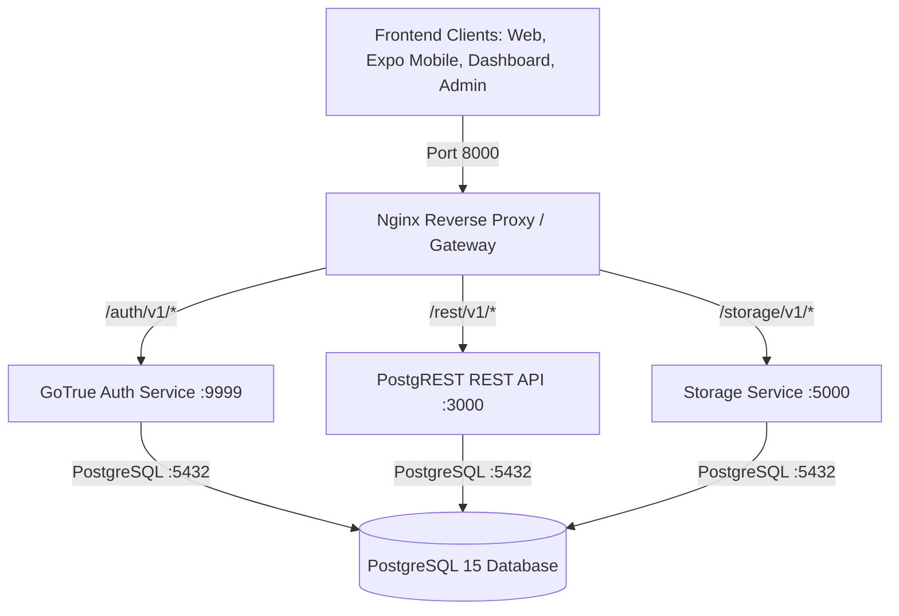

# Hlala Link — Standalone Database Architecture

This directory contains the **100% self-hosted, standalone PostgreSQL + PostgREST + GoTrue Auth + Storage database stack** for **Hlala Link**.

It eliminates reliance on the Supabase cloud (`*.supabase.co`) while maintaining **100% compatibility** with all existing client queries across web, mobile (Expo/React Native), dashboard, and admin panels.

---

## Architecture Overview



### Components

| Service | Technology | Port | Description |
| :--- | :--- | :--- | :--- |
| **Gateway** | Nginx Alpine | `8000` | Unified API entrypoint with CORS enabled |
| **Database** | PostgreSQL 15 | `5432` | Master database (`hlala_link`) with all tables & triggers |
| **Auth** | GoTrue (Supabase Auth) | `9999` (internal) | User signup, signin, password reset, JWT tokens |
| **REST API** | PostgREST 12 | `3000` (internal) | Auto-generated REST endpoints for all tables & views |
| **Storage** | Supabase Storage API | `5000` (internal) | File and property image upload engine |

---

## Quick Start

### 1. Requirements
- [Docker Desktop](https://www.docker.com/products/docker-desktop/) (Windows/macOS) or Docker Engine + Docker Compose (Linux/VPS).

### 2. Start the Stack

**On Windows:**
Double-click `scripts/start.bat` or run:
```powershell
cd standalone-database
docker compose up -d
```

**On Linux / macOS / VPS:**
```bash
cd standalone-database
chmod +x scripts/*.sh
./scripts/start.sh
```

### 3. Verify Health
Open your browser or run:
```bash
curl http://localhost:8000/health
```
You should see:
```json
{"status":"healthy","database":"hlala-link-standalone","version":"2026.1"}
```

---

## Configuration Credentials

The default credentials configured in `.env`:

| Key | Value |
| :--- | :--- |
| **API URL** | `http://localhost:8000` (or `http://YOUR_SERVER_IP:8000`) |
| **Database Name** | `hlala_link` |
| **Postgres User** | `postgres` |
| **Postgres Password** | `hlala_postgres_password_2026` |
| **Anon Public Key** | Found in `standalone-database/.env` |
| **Service Role Key** | Found in `standalone-database/.env` |

---

## Database Management & Backups

### Creating a Backup
- **Windows**: Run `scripts/backup.bat`
- **Linux**: Run `./scripts/backup.sh`
Backups are timestamped and saved into `standalone-database/backups/`.

### Direct PostgreSQL Connection
You can connect using any PostgreSQL client (DBeaver, pgAdmin, TablePlus, VS Code extension, or `psql`):
- **Host**: `localhost` (or your server IP)
- **Port**: `5432`
- **Database**: `hlala_link`
- **User**: `postgres`
- **Password**: `hlala_postgres_password_2026`

---

## Deploying to a Remote VPS (DigitalOcean, AWS, Hetzner, Linode)

1. Copy the `standalone-database/` folder to your VPS.
2. In `.env`:
   - Set `API_EXTERNAL_URL=http://YOUR_SERVER_IP:8000` (or `https://api.yourdomain.com`).
   - Set `SITE_URL=http://YOUR_FRONTEND_DOMAIN.com`.
3. Run `docker compose up -d`.
4. Point your frontends to `http://YOUR_SERVER_IP:8000`.
